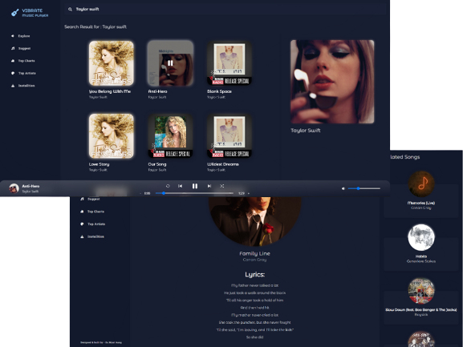

<div align="center">
  
</div>
<h1 align="center">
    Vibrate Music Player Progressive Web App  
</h1>
<p align="center">
   Music Player (PWA) Web App <a href="https://vbra.netlify.app/" target="_blank"> Vibrate </a> built with <a href="https://reactjs.org/" target="_blank"> React </a> and hosted with <a href="https://www.netlify.com/" target="_blank">Netlify</a>
</p>
<br />

### Click to <a href="https://vbra.netlify.app/" target="_blank"> Visit </a>
 
<br />
<br />
 <a href="https://vbra.netlify.app/" target="_blank">
    
  </a>
  
  <br />
<br />
  <br />
<br />


> The app is designed to provide users with fast and easy access to the latest and most popular music. With its unique and modern design, Vibrate offers an intuitive and enjoyable experience for music lovers.

  <br />
  
## Installation

#### Installing on Windows or macOS or Mobile.  <a href="https://vbra.netlify.app/installation" target="_blank"> Check here for more information. </a>

 <br />
<br />

## Built with

```bash

 React

 Redux toolkit

 TailwindCSS

 Styled-components

```

  <br />

## Used

```bash
 Vite       React-Router-Dom     Rapid API
```

  <br />

### Color Reference

| Color        | Hex       |
| ------------ | --------- |
| Blue         | `#181E31` |
| SideBar Blur | `#13192C` |

<br />

### Fonts

```bash
  Monospace
  Montserrat Alternates
```

<br />

## About

> **Include the ability to be responsive to all screen sizes.** <br> **Fast and reliable access to music with Rapid API.** <br> **Used Progressive Web App (PWA) for being able to install the app on any device** <br> **Advanced search functionality for being able to find any songs you want, quickly and easily.** <br> **Advanced data handling and customization with Redux toolkit.** <br> **Pause/play control bar with advanced features for enhanced playback and customization.**

<br />
<br />
 
 
 <div align="center">
  
  <h6> Designed & Built By <a href="https://github.com/sumyat-aung/">Su Myat Aung</a></h1>
</div>
